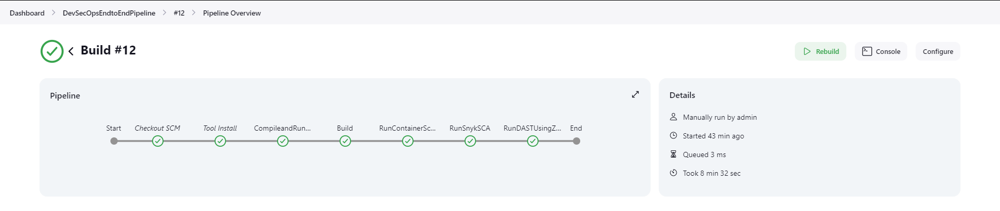
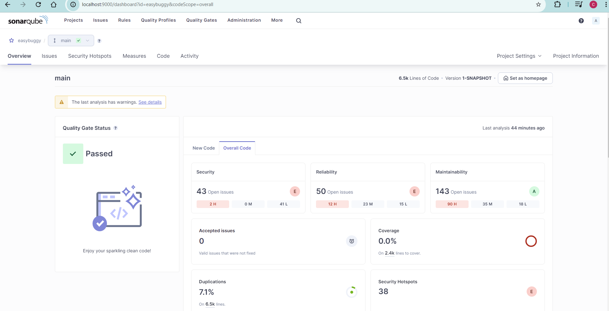
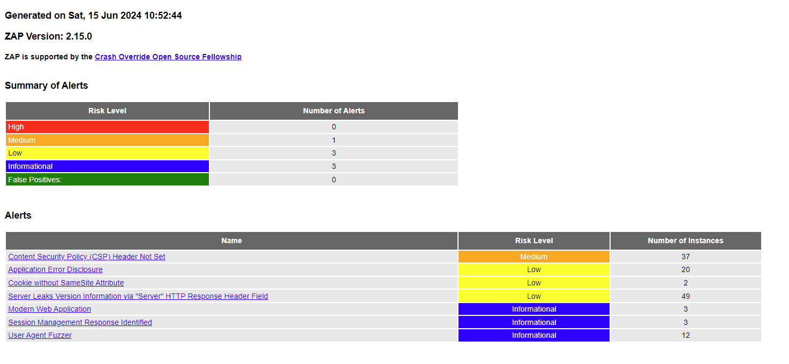

# End-to-End DevSecOps Pipeline

[](https://www.jenkins.io/)
[](https://www.sonarqube.org/)
[](https://www.zaproxy.org/)
[](https://snyk.io/)
[](https://www.docker.com/)
[](https://aws.amazon.com/ec2/)

A fully operational end-to-end DevSecOps pipeline built with Jenkins, integrating SAST, DAST, container scanning, and software composition analysis (SCA) into a single automated CI/CD workflow.

The pipeline was tested against **EasyBuggy** — a deliberately vulnerable Java web application — deployed on an AWS EC2 instance, providing a realistic target for dynamic security testing.

---

## What this demonstrates

| Skill | Implementation |
|---|---|
| CI/CD pipeline orchestration | Jenkins pipeline with 5 sequential security stages |
| SAST — static analysis | SonarQube / SonarCloud scanning compiled Java code |
| DAST — dynamic analysis | OWASP ZAP scanning a live application on AWS EC2 |
| Container security | Snyk container scan of Docker image for known CVEs |
| SCA — dependency analysis | Snyk Maven integration scanning third-party libraries |
| Infrastructure | AWS EC2 provisioned as live test target for DAST |
| Containerization | Dockerfile build and Docker Hub registry push |

---

## Pipeline architecture



---

## Pipeline stages

```
Code commit
    │
    ▼
┌─────────────────────┐
│  1. SAST            │  SonarQube — static code analysis
│     SonarQube       │  Identifies bugs, code smells, security hotspots
└──────────┬──────────┘
           │
    ┌──────▼──────┐
    │  2. Build   │  Maven compile → Docker image → Docker Hub push
    └──────┬──────┘
           │
    ┌──────▼──────────────┐
    │  3. Container scan  │  Snyk scans Docker image for CVEs
    └──────┬──────────────┘
           │
    ┌──────▼──────────────┐
    │  4. SCA             │  Snyk Maven — scans pom.xml dependencies
    └──────┬──────────────┘
           │
    ┌──────▼──────────────┐
    │  5. DAST            │  OWASP ZAP scans live app on AWS EC2
    └─────────────────────┘
```

### Stage details

**Stage 1 — SAST: SonarQube analysis**
Maven compiles the project and ships results to SonarCloud. Identifies security hotspots, bugs, and code quality issues in static code before anything is built or deployed.

**Stage 2 — Build**
Builds a Docker image from the Dockerfile and pushes it to Docker Hub. This is the artifact all subsequent stages operate on.

**Stage 3 — Container scan**
Snyk scans the built Docker image against its vulnerability database, surfacing known CVEs in the base image and installed packages.

**Stage 4 — SCA: Dependency scan**
Snyk Maven integration scans `pom.xml` for vulnerabilities in third-party dependencies — supply chain risk before the app ever runs.

**Stage 5 — DAST: OWASP ZAP**
OWASP ZAP runs in command-line mode against the EasyBuggy application deployed live on an AWS EC2 instance. Dynamic testing finds runtime vulnerabilities that static analysis misses — XSS, injection, insecure headers, open redirects.

---

## Results

**Jenkins pipeline — all stages passing**


Full Jenkins console log: [JenkinsConsoleOutput](JenkinsConsoleOutput)

**SonarQube SAST output**



**OWASP ZAP DAST output**



Full ZAP report: [ZAPOutput.html](ZAPOutput.html)

---

## About the test target

**EasyBuggy** is a deliberately vulnerable Java web application used here as a realistic DAST target. It was deployed on an AWS EC2 instance so OWASP ZAP could scan a live, running application rather than a mock.

EasyBuggy intentionally contains SQL injection, XSS, CSRF, open redirects, session fixation, and numerous other vulnerabilities — making it an ideal target for validating that the DAST stage actually catches real issues.

> EasyBuggy source: [k-tamura/easybuggy](https://github.com/k-tamura/easybuggy). All pipeline tooling and configuration in this repository is original work.

---

## Repository structure

```
.
├── Jenkinsfile                     # Pipeline definition — all 5 stages
├── Dockerfile                      # Container image build
├── pom.xml                         # Maven build + Snyk SCA target
├── src/main/                       # EasyBuggy application source
├── setup-guide.md                  # Jenkins, SonarQube, Snyk, ZAP setup steps
├── JenkinsConsoleOutput            # Full pipeline run output
└── ZAPOutput.html                  # OWASP ZAP DAST report
```

---

## Prerequisites

- Jenkins with Docker Pipeline plugin
- Maven 3.8.7
- Docker + Docker Hub account
- SonarQube / SonarCloud account
- Snyk CLI + Snyk account
- OWASP ZAP
- AWS EC2 instance (for DAST target)

---

## Setup

See [setup-guide.md](setup-guide.md) for step-by-step configuration of Jenkins credentials, SonarQube server, Snyk integration, and ZAP.

**Jenkins credentials required:**

| Credential ID | Purpose |
|---|---|
| `SONAR_TOKEN` | SonarQube / SonarCloud authentication |
| `dockerlogin` | Docker Hub registry login |
| `SNYK_TOKEN` | Snyk CLI authentication |
